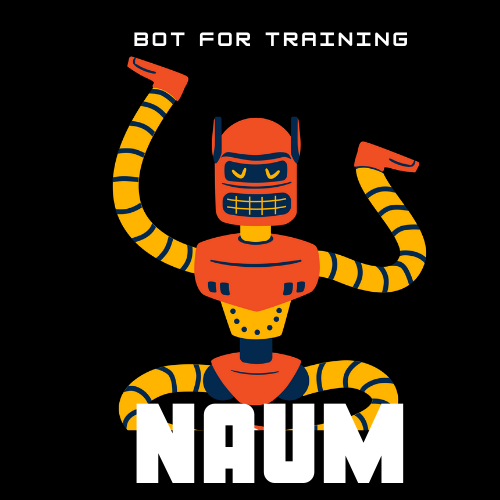

<h1  align="center">NAUM | LCD</h1>

<b>Telegram Bot helping to fill out an internship application for NAUMEN company</b>

  

## How it works?

Type /start and follow the bot's instructions.

  

## Links

+  [Presentation](https://www.canva.com/design/DAEcnvCluDo/utsAwy40iLsrZBoglRHjpw/view?utm_content=DAEcnvCluDo&utm_campaign=designshare&utm_medium=link&utm_source=publishpresent)

  

## Creators

  

*  [miracaptured](https://github.com/miracaptured)

*  [IlyaProdma](https://github.com/IlyaProdma)

*  [HtWwiY](https://github.com/HtWwiY)